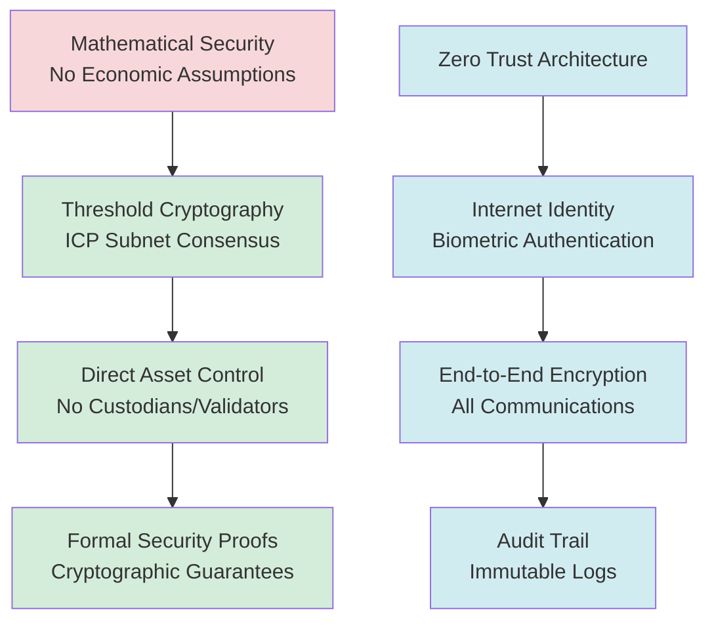
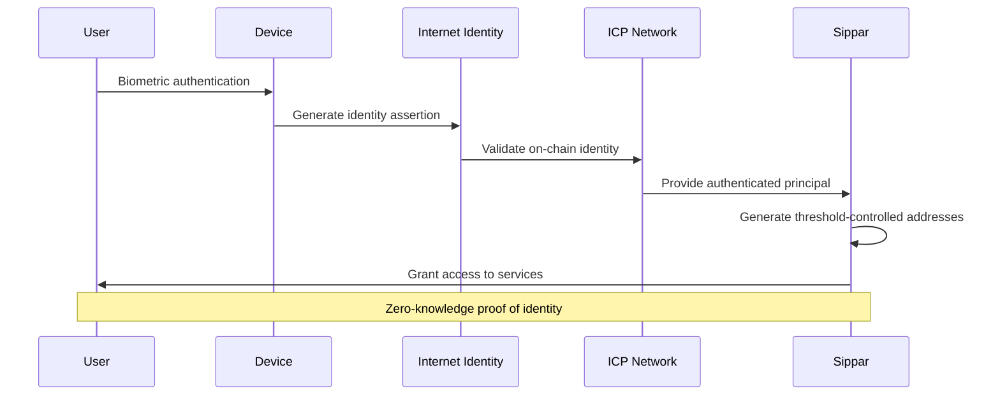
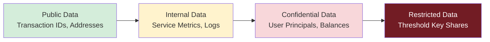
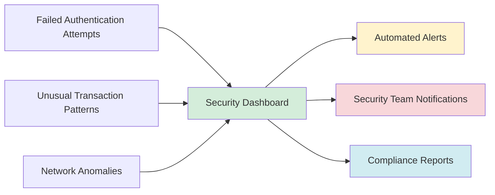
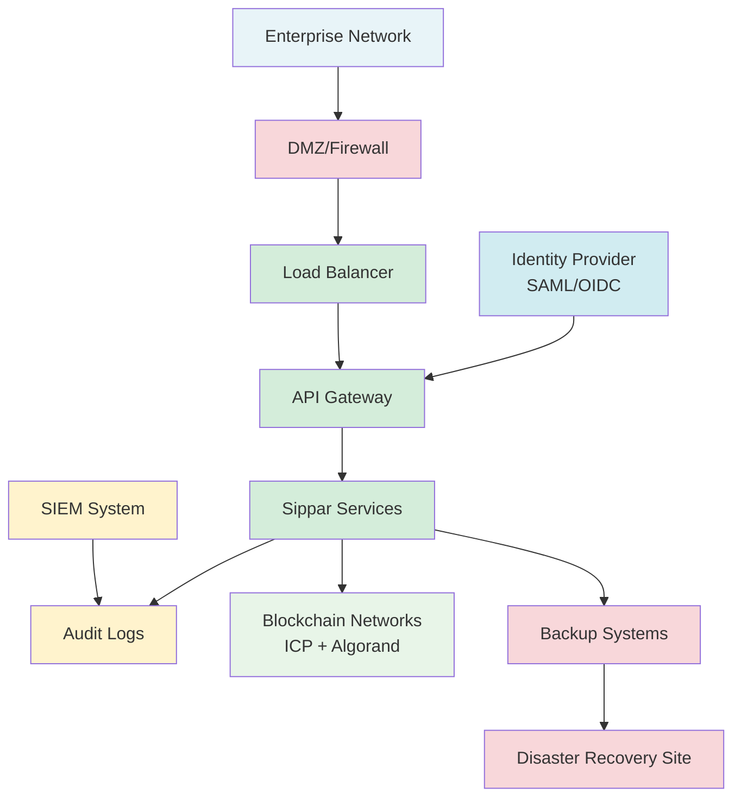

# Sippar Enterprise Security Framework

**Version**: 1.0.0-production
**Date**: December 19, 2025
**Classification**: Public
**Purpose**: Enterprise security assessment and compliance framework

## 🔐 **Security Overview**

Sippar implements a **mathematically secure** cross-chain bridge using ICP Chain Fusion technology, eliminating traditional bridge vulnerabilities through threshold cryptography rather than economic incentives.

### **Security Architecture Principles**

## 🛡️ **Threat Model & Risk Assessment**

### **Traditional Bridge Vulnerabilities (ELIMINATED)**

| **Traditional Risk** | **Sippar Mitigation** | **Security Level** |
|---------------------|----------------------|-------------------|
| **Smart Contract Exploits** | No bridge contracts - direct control | ✅ **ELIMINATED** |
| **Validator Compromise** | No validators - subnet consensus | ✅ **ELIMINATED** |
| **Economic Attacks** | No economic assumptions | ✅ **ELIMINATED** |
| **Custodial Risk** | User controls keys via threshold sigs | ✅ **ELIMINATED** |
| **Governance Attacks** | Decentralized ICP governance | 🟡 **MITIGATED** |

### **Remaining Attack Vectors & Mitigations**

#### **1. Network-Level Attacks**
- **DDoS Protection**: Cloudflare enterprise protection + ICP resilience
- **Eclipse Attacks**: Multiple node connections + ICP network diversity
- **BGP Hijacking**: Monitor network paths + DNS over HTTPS

#### **2. Client-Side Attacks**
- **Browser Exploits**: Content Security Policy + Subresource Integrity
- **Phishing**: Domain verification + Internet Identity integration
- **Malware**: Hardware security modules recommended for high-value users

#### **3. Operational Security**
- **Key Management**: ICP threshold keys distributed across geography
- **Service Availability**: Multi-region deployment + automated failover
- **Data Integrity**: Immutable audit logs + cryptographic verification

## 🔒 **Authentication & Access Control**

### **Internet Identity Integration**

### **Role-Based Access Control (RBAC)**

| **Role** | **Permissions** | **Use Cases** |
|----------|----------------|---------------|
| **End User** | Basic operations, balance queries | Individual users |
| **Developer** | API access, integration testing | Application developers |
| **Enterprise Admin** | Team management, billing oversight | Corporate accounts |
| **Auditor** | Read-only access to compliance data | Security assessments |

### **Multi-Factor Authentication**
- **Primary**: Internet Identity (biometric/device)
- **Secondary**: Hardware security keys (FIDO2/WebAuthn)
- **Enterprise**: SAML/OIDC integration available

## 📊 **Compliance Framework**

### **Regulatory Alignment**

#### **SOC 2 Type II Compliance**
- **Security**: Threshold cryptography + hardware security modules
- **Availability**: 99.9% uptime SLA with automated monitoring
- **Processing Integrity**: Immutable transaction logs + cryptographic proofs
- **Confidentiality**: End-to-end encryption + zero-knowledge architecture
- **Privacy**: GDPR-compliant data handling + user consent management

#### **Financial Services Compliance**
- **AML/KYC**: Configurable compliance modules for enterprise customers
- **GDPR**: Data minimization + right to erasure (off-chain data only)
- **PCI DSS**: No credit card data handling - crypto-native payments only
- **ISO 27001**: Information security management system alignment

#### **Blockchain-Specific Standards**
- **EIP-1559**: Fee market compatibility on supported networks
- **BIP-39**: Hardware wallet integration standards
- **RFC-6979**: Deterministic signature generation
- **FIDO2**: Hardware authentication device support

### **Data Protection & Privacy**

#### **Data Classification**

#### **Data Retention Policy**
- **Transaction Data**: Permanent (blockchain immutability)
- **User Session Data**: 30 days maximum
- **Audit Logs**: 7 years (compliance requirement)
- **Temporary Keys**: Immediate deletion after use

#### **Geographic Data Residency**
- **EU**: GDPR-compliant data centers in Frankfurt
- **US**: SOC 2 certified facilities in multiple regions
- **Asia**: Singapore data center for APAC customers
- **Sovereignty**: Government cloud options available

## 🔍 **Audit & Monitoring**

### **Real-Time Security Monitoring**

#### **Threat Detection**
- **Anomaly Detection**: ML-based transaction pattern analysis
- **Rate Limiting**: Adaptive throttling based on risk assessment
- **Geofencing**: Location-based access controls for sensitive operations
- **Device Fingerprinting**: Hardware-based device identification

#### **Security Metrics Dashboard**

### **Audit Trail Requirements**

#### **Immutable Logging**
- **Blockchain Events**: All transactions recorded on-chain
- **API Access**: Comprehensive request/response logging
- **Administrative Actions**: Full audit trail with digital signatures
- **Compliance Events**: Automated compliance violation detection

#### **Audit Report Generation**
- **Real-Time**: Live compliance status dashboard
- **Scheduled**: Daily, weekly, monthly compliance reports
- **On-Demand**: Custom audit reports for security assessments
- **Third-Party**: Integration with external audit systems

## 🚨 **Incident Response Framework**

### **Security Incident Classification**

| **Severity** | **Definition** | **Response Time** | **Escalation** |
|-------------|----------------|------------------|----------------|
| **P0 - Critical** | Service unavailable, data breach | < 15 minutes | CEO + CTO |
| **P1 - High** | Degraded service, security vulnerability | < 1 hour | Security team |
| **P2 - Medium** | Minor service issues, potential threats | < 4 hours | On-call engineer |
| **P3 - Low** | Documentation, non-urgent security items | < 24 hours | Next business day |

### **Emergency Response Procedures**

#### **Service Disruption**
1. **Immediate**: Activate backup systems + notify stakeholders
2. **Assessment**: Determine root cause + scope of impact
3. **Mitigation**: Implement temporary fixes + prevent further damage
4. **Recovery**: Restore full service + validate system integrity
5. **Post-Mortem**: Document lessons learned + implement improvements

#### **Security Breach**
1. **Containment**: Isolate affected systems + preserve evidence
2. **Assessment**: Determine data exposure + regulatory obligations
3. **Notification**: Contact users, regulators, and law enforcement as required
4. **Remediation**: Fix vulnerabilities + enhance security measures
5. **Follow-Up**: Monitor for ongoing threats + update policies

### **Business Continuity Planning**

#### **Disaster Recovery**
- **RTO (Recovery Time Objective)**: 4 hours maximum
- **RPO (Recovery Point Objective)**: 1 hour maximum data loss
- **Backup Strategy**: Multi-region replication + automated failover
- **Testing**: Quarterly disaster recovery exercises

#### **Service Availability**
- **SLA Target**: 99.9% uptime (8.76 hours downtime/year maximum)
- **Monitoring**: 24/7 automated monitoring + alerting
- **Redundancy**: Multi-cloud deployment + load balancing
- **Capacity Planning**: Auto-scaling based on demand

## 🎯 **Security Best Practices for Enterprises**

### **Implementation Checklist**

#### **For IT Administrators**
- [ ] Configure enterprise SSO integration (SAML/OIDC)
- [ ] Set up dedicated network access (VPN/private cloud)
- [ ] Enable audit log forwarding to SIEM systems
- [ ] Implement IP whitelisting for sensitive operations
- [ ] Configure multi-signature requirements for high-value transactions
- [ ] Set up automated compliance monitoring and reporting

#### **For Security Teams**
- [ ] Review threat model and security architecture
- [ ] Conduct penetration testing of integration points
- [ ] Validate cryptographic implementations with security audit
- [ ] Set up security monitoring and alerting rules
- [ ] Establish incident response procedures and contacts
- [ ] Create security awareness training for end users

#### **For Compliance Officers**
- [ ] Map regulatory requirements to platform controls
- [ ] Establish data retention and deletion policies
- [ ] Configure audit reporting for regulatory compliance
- [ ] Review privacy impact assessment and data flows
- [ ] Set up automated compliance monitoring and alerting
- [ ] Establish legal hold procedures for litigation support

### **Enterprise Deployment Architecture**

## 📞 **Security Contact Information**

### **Security Team**
- **Email**: security@sippar.io
- **Emergency Hotline**: +1-XXX-XXX-XXXX (24/7)
- **PGP Key**: Available at keybase.io/sippar
- **Bug Bounty**: HackerOne program for responsible disclosure

### **Compliance Team**
- **Email**: compliance@sippar.io
- **Privacy Officer**: privacy@sippar.io
- **Legal**: legal@sippar.io

---

**🔐 This security framework demonstrates Sippar's commitment to enterprise-grade security through mathematical proofs rather than economic assumptions, providing unprecedented security guarantees for cross-chain asset management.**

*For detailed implementation guides and technical specifications, see the [Technical Security Documentation](technical-security.md).*