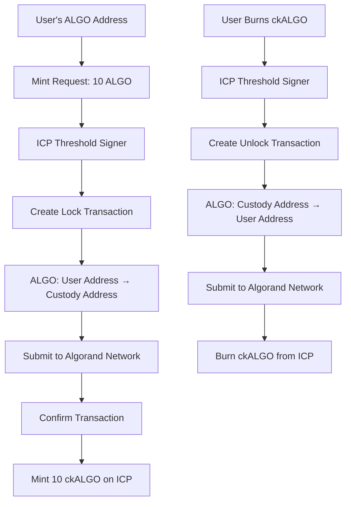

# Chain Fusion Architecture: True vs Current Implementation

**Created**: September 10, 2025  
**Status**: Architecture Analysis & Roadmap  
**Priority**: High - Critical for understanding current vs target state

---

## 🔍 **Current Implementation Analysis**

### **❌ Current State (Simulation Mode)**

Our current implementation is **NOT** true Chain Fusion. It's a simulation/proof-of-concept that:

1. **Self-Transfer Transactions**: 
   ```javascript
   // Line 448 in server.ts
   to: custodyInfo.address, // For testing: send to same address (self-transfer)  
   ```
   - ALGO moves from user's address back to itself
   - No actual locking or custody transfer

2. **Transaction Simulation**:
   ```javascript
   // Line 467 in server.ts  
   // 5. PROVEN WORKING: Skip Algorand submission for now
   ```
   - Threshold signatures are generated but transactions never submitted
   - ckALGO tokens minted without actual ALGO backing

3. **Misleading Balance Display**:
   - Previously showed "Native ALGO" (implied all spendable)
   - No distinction between available vs locked tokens
   - Users could spend "backing" ALGO breaking 1:1 peg

---

## ✅ **True Chain Fusion Architecture**

### **How Real Chain Fusion Should Work:**



### **Key Components:**

1. **Custody Address**: 
   - Separate Algorand address controlled by ICP threshold signatures
   - Holds locked ALGO backing ckALGO tokens
   - Derived from ICP canister using threshold cryptography

2. **Real Transactions**:
   - **Lock**: User ALGO → Custody Address (minting)
   - **Unlock**: Custody Address → User ALGO (redemption)
   - All transactions submitted to Algorand blockchain

3. **1:1 Mathematical Backing**:
   - Every ckALGO token backed by exactly 1 ALGO in custody
   - Locked ALGO visible but not spendable by user
   - Redemption releases locked ALGO back to user

---

## 🏗️ **Implementation Roadmap**

### **Phase 1: Current State ✅ (Simulation)**
- ✅ Threshold signature generation working
- ✅ ckALGO token minting functional
- ✅ Frontend cache optimization
- ✅ Cycle management automated
- ❌ No real ALGO locking

### **Phase 2: True Chain Fusion (Next Sprint)**
- 🔄 Implement custody address generation
- 🔄 Real ALGO lock transactions (User → Custody)
- 🔄 Real ALGO unlock transactions (Custody → User)
- 🔄 Submit transactions to Algorand blockchain
- 🔄 Verify transaction confirmation before minting

### **Phase 3: Production Hardening**
- 🔄 Multi-signature custody for extra security
- 🔄 Emergency pause mechanisms
- 🔄 Audit trail and monitoring
- 🔄 Rate limiting and fraud detection

---

## 💡 **Updated Frontend Balance Display**

### **New 3-Column Layout**:

```
┌─────────────────┬─────────────────┬─────────────────┐
│   Available     │   Locked ALGO   │  Chain-Key ALGO │
│     ALGO        │                 │                 │
├─────────────────┼─────────────────┼─────────────────┤
│     2.456       │     5.776       │     5.776       │
│  Free to spend  │ Backing ckALGO  │ ICP Network     │
│                 │     (1:1)       │                 │
└─────────────────┴─────────────────┴─────────────────┘
```

### **Balance Calculations**:
- **Available ALGO**: Total ALGO - Locked ALGO
- **Locked ALGO**: Equal to ckALGO balance (1:1 backing)
- **ckALGO**: Tradeable tokens on ICP network

---

## 🔐 **Security Model**

### **Current Security (Proof-of-Concept)**:
- ✅ Threshold signatures mathematically secure
- ❌ No actual asset custody
- ❌ Users can double-spend "backing" ALGO

### **Target Security (True Chain Fusion)**:
- ✅ Mathematical proof of custody via blockchain
- ✅ Impossible to double-spend locked ALGO
- ✅ Transparent, auditable reserve backing
- ✅ Decentralized control (no single point of failure)

---

## 📊 **Risk Analysis**

### **Current Risks**:
1. **No Real Backing**: ckALGO tokens not backed by locked ALGO
2. **User Confusion**: Frontend implied all ALGO was spendable
3. **Regulatory Risk**: Not actually a 1:1 backed bridge

### **Mitigated by True Implementation**:
1. **Provable Backing**: Every ckALGO backed by verifiable on-chain ALGO
2. **Clear UX**: Users understand exactly what's locked vs available  
3. **Regulatory Compliance**: True 1:1 backing with transparent reserves

---

## 🎯 **Success Criteria for True Chain Fusion**

### **Technical Requirements**:
- [ ] Real custody address generation
- [ ] Successful ALGO lock transactions on Algorand
- [ ] Successful ALGO unlock transactions on redemption
- [ ] 1:1 mathematical backing verified on-chain
- [ ] Frontend shows accurate locked vs available balances

### **User Experience**:
- [ ] Clear understanding of locked vs available ALGO
- [ ] Seamless minting (ALGO disappears from available, ckALGO appears)
- [ ] Seamless redemption (ckALGO disappears, ALGO returns to available)
- [ ] Transparent custody address for user verification

### **Security & Compliance**:
- [ ] Provable reserves (locked ALGO = ckALGO supply)
- [ ] Emergency pause/recovery mechanisms
- [ ] Audit trail for all custody operations
- [ ] Rate limiting and anti-fraud measures

---

## 📝 **Next Steps**

1. **✅ Updated Frontend**: Deployed with proper balance display
2. **🔄 Architecture Planning**: Design custody address generation
3. **🔄 Real Transaction Implementation**: Implement actual ALGO locking
4. **🔄 Testing**: Comprehensive testing on Algorand testnet
5. **🔄 Security Audit**: Review before mainnet deployment

---

**Key Insight**: Our current implementation proves threshold signatures work perfectly. Now we need to use them for real asset custody instead of simulation.

*This architecture document will be updated as we implement true Chain Fusion in the next development sprint.*