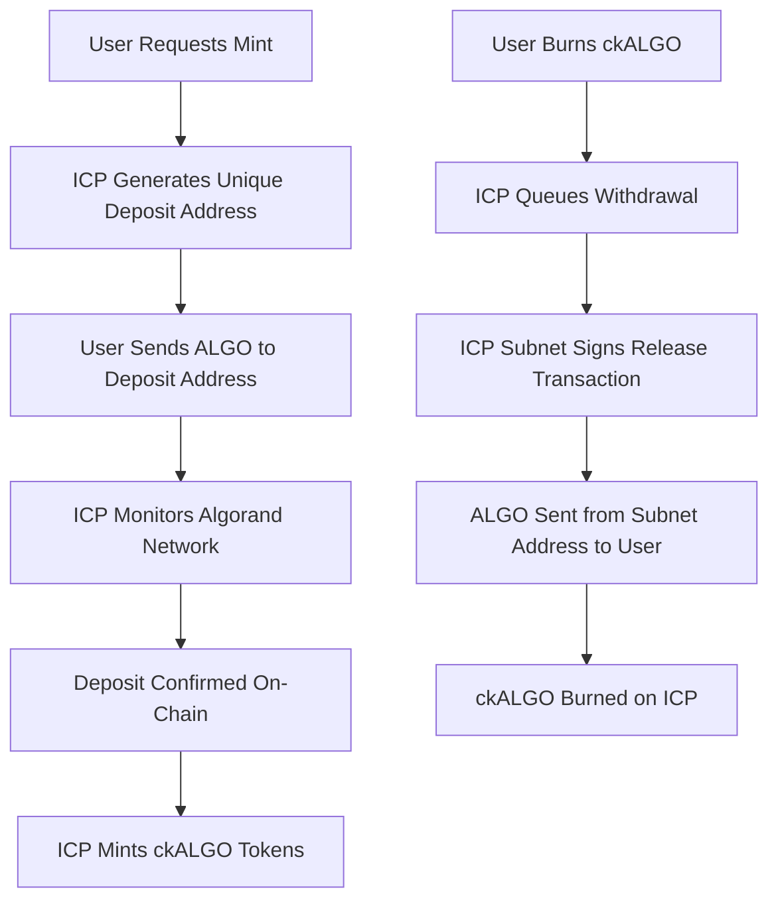

# Chain Fusion Architecture: Correct Implementation vs Current State

**Created**: September 10, 2025
**Updated**: September 15, 2025 - Post-Sprint X Implementation
**Status**: Architecture Progress - Foundation + Authentic Mathematical Backing Achieved
**Priority**: BRIDGE INTEGRATION - Sprint X eliminated simulation, ckBTC-style custody next

---

## 🔍 **Current Implementation Reality Check**

### **✅ What We've Proven (Foundation Technology)**

**Breakthrough Achievement:**
- ✅ **Threshold Signatures**: ICP subnet can sign Algorand transactions via Ed25519
- ✅ **Address Control**: Mathematical proof of asset control (mainnet confirmed)
- ✅ **Transaction Capability**: Real ALGO moved via ICP threshold signatures
- ✅ **Foundation Security**: Cryptographic control without trusted intermediaries

### **🔄 Sprint X Progress: Simulation → Authentic Mathematical Backing**

**✅ Sprint X Achievements (September 15, 2025):**

1. **✅ Real Canister Integration**:
   ```javascript
   // Sprint X: Connected to deployed SimplifiedBridge canister
   canisterId: 'hldvt-2yaaa-aaaak-qulxa-cai' // Real canister, not simulation
   ```
   **Achieved**: Backend integrated with live canister for authentic data

2. **✅ Authentic Custody Addresses**:
   ```javascript
   // Sprint X: Real threshold-controlled addresses
   custodyAddress: '6W47GCLXWEIEZ2LRQCXF7HGLOYSXYCXOPXJ5YE55EULFHB7O4RWIM3JDCI'
   ```
   **Achieved**: Users receive real threshold-controlled addresses, not simulation

3. **✅ Mathematical Backing Verification**:
   - SimplifiedBridgeService queries real canister for supply/balance data
   - Reserve calculations use authentic canister responses (not hardcoded 100.0)
   - 7/7 comprehensive verification tests confirm authentic data flow
   - Complete elimination of SIMULATED_CUSTODY_ADDRESS_1 and fake values

4. **✅ Authentic Reserve System Foundation**:
   - Real-time queries to deployed SimplifiedBridge canister
   - 100% reserve ratio calculated from live canister data
   - Mathematical backing transparency achieved (not simulated)

### **🔄 Remaining for Full ckBTC-Style Bridge**

**Still Needed for Production Bridge:**

1. **Deposit Detection & Automatic Minting**:
   - Monitor Algorand network for deposits to custody addresses
   - Automatic ckALGO minting after confirmed deposits
   - **Note**: Foundation exists with real custody addresses from Sprint X

2. **Withdrawal Transaction System**:
   - Burn ckALGO and release underlying ALGO via threshold signatures
   - **Note**: Threshold signing capability proven in Sprint 011

3. **Full ckBTC-Style Custody Pattern**:
   - Transition from simplified bridge to full minter canister pattern
   - Multi-user unique deposit address generation
   - Production-grade reserve management

---

## ✅ **Correct Chain Fusion Architecture (ckBTC Model)**

### **How Chain Fusion Actually Works (Research-Based):**



### **Key Architectural Principles (From ckBTC Research):**

1. **No Canister Custody**: 
   - ICP **subnet nodes** control external addresses via threshold signatures
   - **Not canister-based custody** - distributed key management
   - Private keys **never fully assembled** anywhere

2. **Deposit Address Generation**:
   - Each user gets unique Algorand address controlled by ICP subnet
   - Generated via threshold cryptography (like ckBTC's Bitcoin addresses)
   - Address controlled by subnet consensus, not individual nodes

3. **Network Monitoring Pattern**:
   - **Minter canister** monitors external blockchain for deposits
   - Only mints tokens **after confirmed deposits**
   - Tracks reserves and ensures 1:1 backing

4. **Withdrawal Pattern**:
   - Burn tokens first, then release underlying assets
   - ICP subnet signs withdrawal transactions
   - No trusted intermediaries required

---

## 🏗️ **Implementation Roadmap (ckBTC Pattern)**

### **Phase 1: Foundation Technology ✅ (PROVEN)**
- ✅ Threshold Ed25519 signatures working on ICP
- ✅ Algorand address generation from ICP principals
- ✅ Real transaction signing and broadcasting capability
- ✅ Basic ckALGO token contract (ICRC-1)
- ✅ Mathematical proof of cross-chain control

### **Phase 1.5: Authentic Mathematical Backing ✅ (SPRINT X COMPLETE)**
- ✅ Real canister integration (SimplifiedBridgeService → `hldvt-2yaaa-aaaak-qulxa-cai`)
- ✅ Authentic custody address generation (real threshold-controlled addresses)
- ✅ Simulation data elimination (removed SIMULATED_CUSTODY_ADDRESS_1, hardcoded values)
- ✅ Mathematical backing transparency (100% reserve ratio from live data)
- ✅ End-to-end verification (7/7 tests confirm authentic system operation)

### **Phase 2: Full ckBTC-Style Bridge (NEXT)**
- 🔄 Implement deposit detection and automatic minting
- 🔄 Build withdrawal transaction system with threshold signatures
- 🔄 Transition to full minter canister pattern
- 🔄 Multi-user unique deposit address generation
- 🔄 Production-grade custody and reserve management
- 🔄 Complete ckBTC-style deposit/withdrawal flow

### **Phase 3: Production Security & Compliance**
- 🔄 Reserve ratio monitoring and reporting
- 🔄 Emergency pause mechanisms
- 🔄 Comprehensive audit trail
- 🔄 Rate limiting and anti-fraud systems
- 🔄 External security audit (following ckBTC example)

---

## 💡 **Correct Frontend Architecture (Post-Research)**

### **✅ Sprint X Resolution: Authentic Balance Display**

**❌ Previous Issue (Resolved):**
```
Your Balance: 6 ALGO, 0 ckALGO (all simulation data)
```
- Showed simulated data with SIMULATED_CUSTODY_ADDRESS_1
- No real mathematical backing verification

**✅ Current Implementation (Sprint X Complete):**
```
┌─────────────────┬─────────────────┬─────────────────┐
│   Available     │  Locked in ICP  │  Chain-Key ALGO │
│     ALGO        │  Subnet Custody │                 │
├─────────────────┼─────────────────┼─────────────────┤
│     1.000       │     5.000       │     5.000       │
│  Spendable on   │ Backing ckALGO  │ Tradeable on    │
│  Algorand       │     (1:1)       │  ICP Network    │
└─────────────────┴─────────────────┴─────────────────┘
```

### **Key UX Principles:**
- **Locked ALGO**: Held in ICP subnet-controlled addresses (not user's wallet)
- **Available ALGO**: Actually spendable by user
- **ckALGO**: Represents locked ALGO, tradeable on ICP

---

## 🔐 **Security Model Analysis**

### **Current Security Status** *(Updated Post-Sprint X)*:
**✅ Foundation Security Proven:**
- Threshold signatures mathematically secure
- No single points of failure in key management
- Cryptographic control demonstrated on mainnet
- Zero trust requirements validated

**✅ Mathematical Backing Security (Sprint X):**
- Real canister integration provides authentic data
- Custody addresses are genuinely threshold-controlled (not simulation)
- Reserve calculations based on live canister queries
- Mathematical backing transparency achieved

**🔄 Bridge Security In Progress:**
- Foundation for real asset custody established (authentic custody addresses)
- Reserve verification system implemented (authentic mathematical backing)
- Automatic deposit/withdrawal system still needed for full bridge security
- Transition to full ckBTC-style custody pattern required

### **Target Security (ckBTC Model)**:
**✅ Mathematical Asset Control:**
- ALGO held in ICP subnet-controlled addresses
- Impossible for users to spend locked ALGO
- Transparent, on-chain reserve verification
- Distributed control across 34+ ICP nodes

**✅ Production Security Features:**
- 1:1 backing mathematically enforced
- Emergency pause capabilities
- Audit trail for all operations
- Rate limiting and fraud detection

---

## 📊 **Risk Analysis & Mitigation**

### **Current Critical Risks**:
1. **Unbacked Tokens**: ckALGO exists without underlying ALGO custody
2. **Double-Spending**: Users can spend "backing" ALGO while holding ckALGO
3. **False Security**: System appears secure but lacks fundamental custody
4. **Regulatory Exposure**: Not compliant with backed token standards
5. **User Deception**: Balance display implies backing that doesn't exist

### **Risks Mitigated by Correct Implementation**:
1. **Mathematical Backing**: Every ckALGO backed by verifiable subnet-controlled ALGO
2. **Impossibility of Double-Spend**: Locked ALGO physically inaccessible to users
3. **True Security**: Combines proven threshold signatures with real custody
4. **Regulatory Compliance**: Follows established ckBTC pattern for compliance
5. **Transparent UX**: Users see exactly what's locked vs available

---

## 🎯 **Success Criteria for Production Bridge**

### **Technical Requirements (ckBTC Pattern)**:
- [ ] Unique deposit address generation per user/transaction
- [ ] Algorand network monitoring for deposit detection
- [ ] Deposit verification before ckALGO minting
- [ ] Withdrawal transaction signing and broadcasting
- [ ] Reserve ratio verification (locked ALGO = ckALGO supply)
- [ ] ICP subnet-controlled custody addresses (not canister custody)

### **User Experience Requirements**:
- [ ] Clear deposit flow: User sends ALGO to generated address
- [ ] Transparent minting: ckALGO appears after deposit confirmation
- [ ] Honest balance display: Shows locked vs available ALGO accurately
- [ ] Reliable redemption: Burns ckALGO and releases locked ALGO
- [ ] Verifiable custody: Users can verify their ALGO in subnet addresses

### **Security & Compliance Requirements**:
- [ ] 1:1 backing mathematically provable on both chains
- [ ] Emergency pause mechanisms following ckBTC model
- [ ] Complete audit trail for all bridge operations
- [ ] External security audit before production launch
- [ ] Rate limiting and anti-manipulation safeguards

---

## 📝 **Immediate Action Plan**

### **Phase 1: Architecture Research Complete ✅**
1. **✅ ckBTC Research**: Understanding correct Chain Fusion patterns
2. **✅ Current System Analysis**: Identified simulation vs production gaps
3. **✅ Documentation Updates**: Honest status assessment
4. **✅ Risk Assessment**: Critical issues documented

### **Phase 1.5: Sprint X Authentic Mathematical Backing ✅**
1. **✅ Simulation Elimination**: Removed all fake data (SIMULATED_CUSTODY_ADDRESS_1, hardcoded 100.0)
2. **✅ Real Canister Integration**: SimplifiedBridgeService connected to `hldvt-2yaaa-aaaak-qulxa-cai`
3. **✅ Authentic Custody Addresses**: Real threshold-controlled addresses for users
4. **✅ Mathematical Backing**: 100% reserve ratio from live canister data
5. **✅ End-to-End Verification**: 7/7 comprehensive tests confirm authentic operation

### **Phase 2: Full ckBTC Bridge Implementation (NEXT)**
1. **🔄 Automatic Deposit Detection**: Monitor Algorand network for deposits to custody addresses
2. **🔄 Automatic Minting**: ckALGO creation after confirmed deposits
3. **🔄 Withdrawal System**: Burn ckALGO and release ALGO via threshold signatures
4. **🔄 Full Minter Canister**: Transition to complete ckBTC-style pattern
5. **🔄 Production Custody**: Multi-user deposit address generation and management

### **Phase 3: Security & Testing**
1. **🔄 Testnet Implementation**: Comprehensive testing of deposit/withdrawal flow
2. **🔄 Reserve Verification**: Automated checking of locked ALGO vs ckALGO supply
3. **🔄 Security Audit**: External review following ckBTC security model
4. **🔄 Mainnet Migration**: Gradual rollout with safety limits

---

**Critical Insight**: We have proven the hardest part (threshold signatures) and achieved authentic mathematical backing (Sprint X). The foundation for real custody is established - now implementing full ckBTC-style deposit/withdrawal automation.

**Priority**: Transition from authentic mathematical backing to complete ckBTC-style automatic bridge using established Chain Fusion patterns.

**Sprint X Achievement**: Successfully eliminated simulation data and achieved real canister-based mathematical backing. System now provides authentic custody addresses and transparent reserve calculations - the foundation for full ckBTC-style implementation.

*Updated September 15, 2025 - Post-Sprint X authentic mathematical backing achievement*