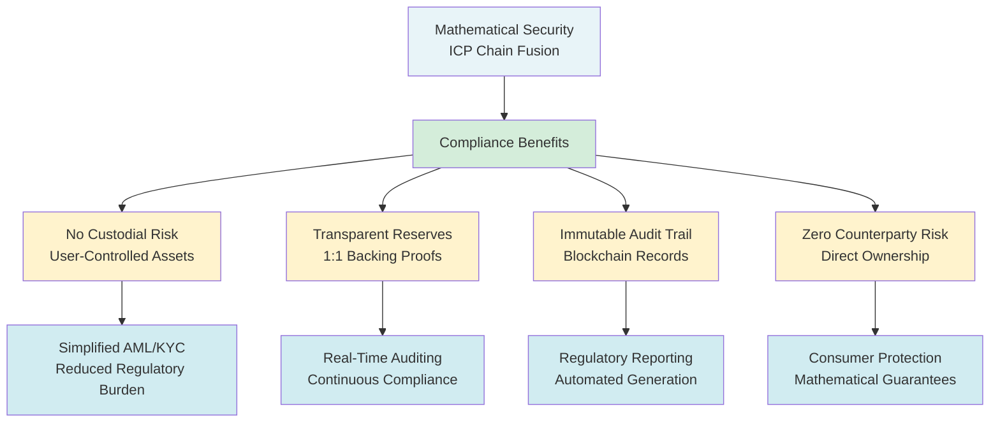
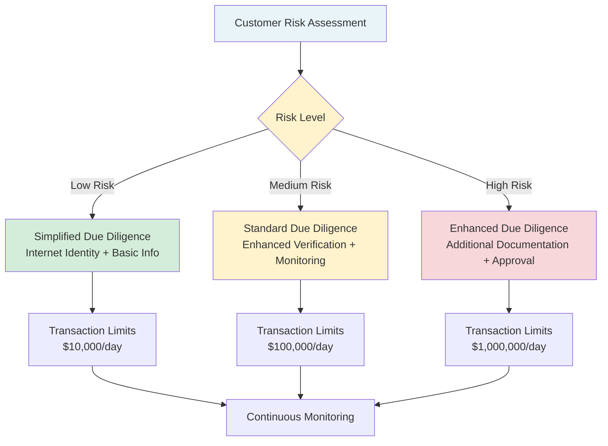
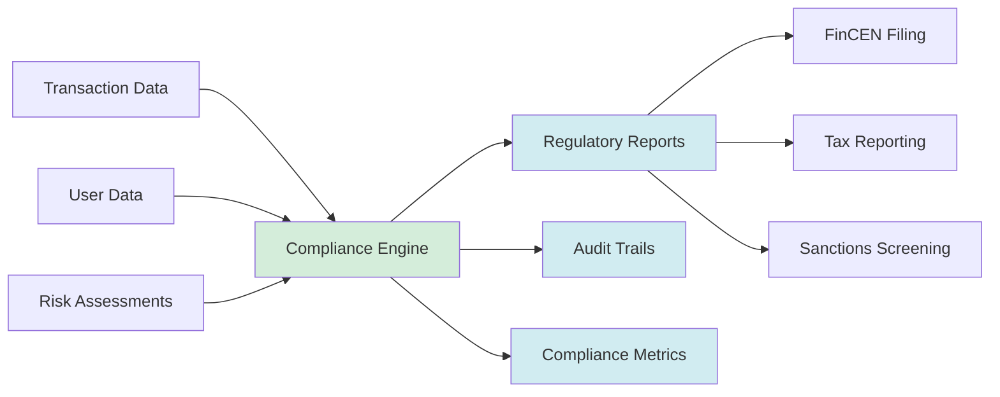
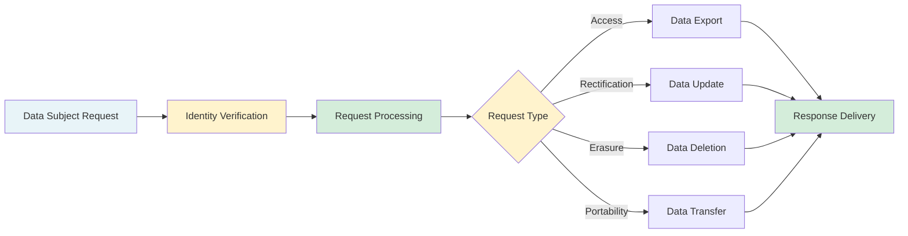
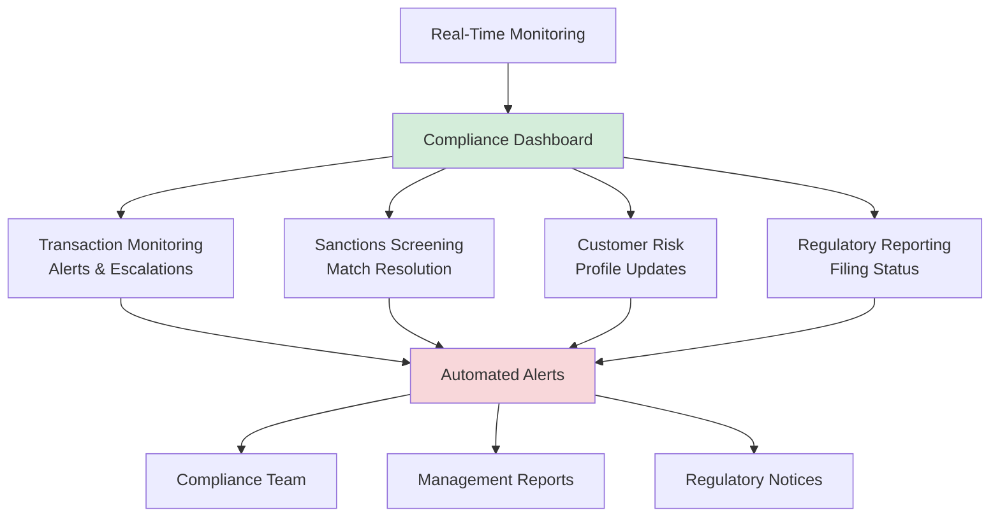

# Sippar Enterprise Compliance Guide

**Version**: 1.0.0-production
**Date**: December 19, 2025
**Audience**: Compliance Officers, Legal Teams, Auditors
**Classification**: Public

## 📋 **Compliance Overview**

Sippar's mathematical security architecture enables simplified compliance by eliminating many traditional DeFi risks through threshold cryptography rather than economic incentives.

### **Regulatory Framework Alignment**

## 🌍 **Jurisdiction-Specific Compliance**

### **United States**

#### **Federal Compliance Requirements**

| **Regulation** | **Applicability** | **Sippar Implementation** | **Status** |
|---------------|-------------------|---------------------------|------------|
| **BSA/AML** | Money transmission | Configurable KYC modules | ✅ **Ready** |
| **CFTC** | Commodity derivatives | No derivatives offered | ✅ **N/A** |
| **SEC** | Securities offerings | No securities issued | ✅ **N/A** |
| **FinCEN** | Currency exchange | MSB registration available | 🟡 **Partner** |
| **OFAC** | Sanctions compliance | Real-time screening available | ✅ **Ready** |

#### **State-Level Requirements**
- **Money Transmitter Licenses**: Partner integration with licensed providers
- **State Securities Laws**: No investment contracts or securities offerings
- **Consumer Protection**: Mathematical security guarantees exceed requirements
- **Data Protection**: CCPA compliance through data minimization architecture

### **European Union**

#### **GDPR Compliance Framework**

| **GDPR Principle** | **Implementation** | **Technical Measures** |
|-------------------|-------------------|----------------------|
| **Lawfulness** | Legitimate interest + consent | Explicit user consent flow |
| **Purpose Limitation** | Service-specific data collection | Minimal data collection architecture |
| **Data Minimization** | Only essential data collected | Zero-knowledge proof systems |
| **Accuracy** | User-controlled data updates | Self-sovereign identity model |
| **Storage Limitation** | Automated data retention policies | 30-day session data deletion |
| **Security** | End-to-end encryption | Threshold cryptography + HSMs |

#### **EU Financial Regulations**
- **MiCA (Markets in Crypto-Assets)**: Compliance framework for asset-referenced tokens
- **PSD2**: Strong customer authentication through Internet Identity
- **AML6**: Enhanced due diligence procedures for high-risk transactions
- **EMIR**: No derivatives trading - regulation not applicable

### **Asia-Pacific**

#### **Singapore MAS Compliance**
- **Payment Services Act**: Digital payment token service license consideration
- **Cybersecurity Act**: Enhanced security requirements implementation
- **PDPA**: Personal data protection through privacy-by-design architecture

#### **Japan FSA Requirements**
- **Crypto Asset Exchange License**: Partnership with licensed operators
- **Act on Prevention of Transfer of Criminal Proceeds**: KYC/AML compliance modules

## 🔍 **KYC/AML Implementation Framework**

### **Risk-Based Approach**

### **Customer Identification Program (CIP)**

#### **Individual Customers**
- **Minimum Required Information**:
  - Full name and date of birth
  - Residential address
  - Government-issued identification number
  - Internet Identity principal (unique identifier)

#### **Business Customers**
- **Corporate Information**:
  - Legal business name and type
  - Business address and incorporation details
  - Tax identification number
  - Beneficial ownership information (25%+ ownership)

#### **Enhanced Due Diligence Triggers**
- Transaction amounts > $10,000
- Customers from high-risk jurisdictions
- Politically Exposed Persons (PEPs)
- Sanctions list matches
- Unusual transaction patterns

### **Transaction Monitoring System**

#### **Automated Monitoring Rules**

| **Alert Type** | **Threshold** | **Action** | **Escalation** |
|---------------|--------------|------------|----------------|
| **Large Transactions** | >$10,000 single | Automatic review | Compliance team |
| **Velocity** | >$25,000/24hr | Hold for review | Senior compliance |
| **Round Dollar** | Exact amounts >$5,000 | Flag for review | Automated system |
| **Cross-Border** | High-risk countries | Enhanced review | Legal team |
| **Structuring** | Just under reporting limits | Immediate escalation | Regulatory filing |

#### **Suspicious Activity Reporting (SAR)**
- **Automated Detection**: ML-based pattern recognition
- **Manual Review**: Compliance team assessment
- **Regulatory Filing**: Automated SAR generation and submission
- **Documentation**: Complete audit trail maintenance

## 📊 **Regulatory Reporting Framework**

### **Real-Time Compliance Dashboard**

### **Automated Report Generation**

#### **Daily Reports**
- Transaction volume and patterns
- High-risk customer activity
- Sanctions screening results
- System health and compliance status

#### **Monthly Reports**
- Comprehensive compliance metrics
- Risk assessment summaries
- Regulatory filing status
- Customer onboarding statistics

#### **Quarterly Reports**
- Compliance program effectiveness
- Risk management performance
- Regulatory examination readiness
- Strategic compliance recommendations

### **Regulatory Examination Support**

#### **Examination Preparation**
- **Document Management**: Centralized compliance documentation
- **Data Room Setup**: Secure examiner access portal
- **Response Coordination**: Dedicated examination response team
- **Timeline Management**: Regulatory deadline tracking and alerts

#### **Standard Examination Requests**
- Policies and procedures documentation
- Transaction monitoring system testing
- Customer due diligence file reviews
- Sanctions compliance verification
- Audit trail completeness validation

## 🛡️ **Data Protection & Privacy Compliance**

### **Privacy-by-Design Architecture**

#### **Data Minimization Principles**
- **Necessary Data Only**: Collect only information required for compliance
- **Purpose Limitation**: Use data only for stated compliance purposes
- **Retention Limits**: Automated deletion of non-essential data
- **User Control**: Self-sovereign identity model empowers users

#### **Technical Privacy Safeguards**
- **Encryption**: End-to-end encryption for all sensitive data
- **Anonymization**: Zero-knowledge proofs where possible
- **Access Controls**: Role-based data access restrictions
- **Audit Logging**: Complete data access audit trails

### **Cross-Border Data Transfer Compliance**

#### **EU-US Data Flows**
- **Adequacy Decisions**: Monitor regulatory developments
- **Standard Contractual Clauses**: Implementation for service providers
- **Binding Corporate Rules**: Enterprise customer option
- **Data Localization**: Regional data residency options

#### **Data Subject Rights Management**

## 🔒 **Information Security Compliance**

### **ISO 27001 Framework Implementation**

#### **Information Security Management System (ISMS)**
- **Security Policy**: Board-approved security governance framework
- **Risk Assessment**: Comprehensive threat and vulnerability analysis
- **Control Implementation**: 114 security controls across 14 domains
- **Continuous Improvement**: Regular security review and enhancement cycles

#### **Key Control Areas**

| **Control Domain** | **Implementation** | **Audit Frequency** |
|-------------------|-------------------|-------------------|
| **Access Control** | RBAC + MFA + privileged access management | Monthly |
| **Cryptography** | Threshold signatures + end-to-end encryption | Quarterly |
| **Physical Security** | Data center security + environmental controls | Bi-annually |
| **Network Security** | Firewalls + IDS/IPS + network segmentation | Monthly |
| **Incident Management** | 24/7 SOC + automated response + forensics | Continuously |

### **SOC 2 Type II Compliance**

#### **Trust Services Criteria**

**Security**
- Multi-layered security architecture with threshold cryptography
- 24/7 security monitoring and incident response
- Regular penetration testing and vulnerability assessments

**Availability**
- 99.9% uptime SLA with automated failover
- Multi-region deployment and disaster recovery
- Comprehensive business continuity planning

**Processing Integrity**
- Immutable blockchain audit trails
- Real-time transaction validation and monitoring
- Cryptographic proof of system integrity

**Confidentiality**
- End-to-end encryption for all sensitive data
- Zero-knowledge proof systems where applicable
- Strict access controls and data classification

**Privacy**
- GDPR-compliant data handling procedures
- Privacy impact assessments for new features
- User consent management and data subject rights

## 📈 **Compliance Metrics & KPIs**

### **Key Performance Indicators**

#### **Operational Metrics**
- **SLA Compliance**: 99.9% uptime target
- **Response Times**: P0 incidents < 15 minutes
- **Data Accuracy**: >99.9% transaction accuracy
- **User Satisfaction**: >95% compliance process satisfaction

#### **Risk Metrics**
- **False Positive Rate**: <5% for transaction monitoring
- **Coverage Rate**: >99% sanctions screening coverage
- **Detection Rate**: >95% for suspicious activity patterns
- **Resolution Time**: <24 hours for compliance alerts

#### **Regulatory Metrics**
- **Filing Timeliness**: 100% on-time regulatory filings
- **Examination Results**: Zero regulatory enforcement actions
- **Audit Findings**: <5 minor findings per annual audit
- **Training Completion**: 100% staff compliance training

### **Continuous Monitoring Dashboard**

## 🎯 **Implementation Roadmap**

### **Phase 1: Foundation (Weeks 1-4)**
- Compliance program documentation
- Risk assessment and control mapping
- Policy and procedure development
- Staff training and certification

### **Phase 2: Technology Implementation (Weeks 5-12)**
- Transaction monitoring system configuration
- Sanctions screening integration
- Regulatory reporting automation
- Audit trail system deployment

### **Phase 3: Testing & Validation (Weeks 13-16)**
- End-to-end compliance testing
- Regulatory examination simulation
- Third-party audit preparation
- Process optimization and refinement

### **Phase 4: Go-Live & Monitoring (Ongoing)**
- Production compliance monitoring
- Regular compliance assessments
- Regulatory relationship management
- Continuous improvement program

## 📞 **Compliance Support**

### **Contact Information**
- **Chief Compliance Officer**: compliance@sippar.io
- **Privacy Officer**: privacy@sippar.io
- **Legal Counsel**: legal@sippar.io
- **Regulatory Affairs**: regulatory@sippar.io

### **External Resources**
- **Legal Counsel**: Top-tier compliance law firms in major jurisdictions
- **Audit Firms**: Big Four accounting firms for independent compliance audits
- **Regulatory Consultants**: Specialized blockchain compliance experts
- **Technology Partners**: RegTech solution providers for automated compliance

---

**📋 This compliance guide demonstrates Sippar's commitment to regulatory excellence through proactive compliance design and implementation, enabling enterprises to confidently adopt chain fusion technology within their regulatory frameworks.**

*For technical implementation details, see the [Technical Compliance Documentation](technical-compliance.md).*