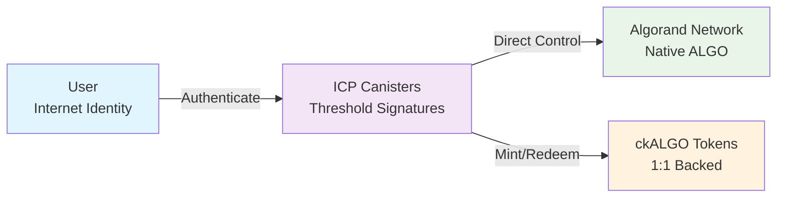
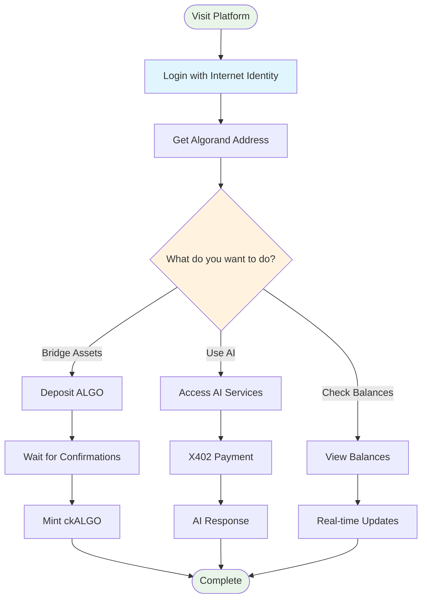

# Getting Started with Sippar

**🚀 Your complete guide to using the world's first intelligent cross-chain automation platform**

Sippar combines ICP Chain Fusion technology with AI-powered services for the Algorand ecosystem. This guide will get you up and running in under 30 minutes.

## 🎯 **Quick Start (5 minutes)**

### **For End Users**

1. **Visit the Platform**: [https://nuru.network/sippar/](https://nuru.network/sippar/)
2. **Login with Internet Identity**:
   - Click "Login with Internet Identity"
   - Choose biometric authentication OR device authentication
   - No wallet setup or seed phrases required!
3. **Get Your Algorand Address**: Your threshold-controlled address will be automatically generated
4. **Verify System Health**: Check that all services show green status

**✅ Success**: You should see your dashboard with balance information and AI chat available.

### **For Developers**

1. **Check Prerequisites**:
   ```bash
   node --version  # Requires Node.js 18+
   npm --version   # Requires npm 8+
   ```

2. **Try the API**:
   ```bash
   # Test the health endpoint
   curl https://nuru.network/api/sippar/health

   # Should return: {"status": "healthy", "service": "Sippar Algorand Chain Fusion Backend"}
   ```

3. **Install SDK** (when available):
   ```bash
   npm install @sippar/sdk
   ```

## 🔧 **Detailed Setup Guides**

### **End User Guide: Your First ckALGO Operation**

#### **Step 1: Login and Setup (2 minutes)**
1. Go to [https://nuru.network/sippar/](https://nuru.network/sippar/)
2. Click **"Login with Internet Identity"**
3. Choose your authentication method:
   - **Biometric**: Use fingerprint or Face ID
   - **Device**: Use this device as your authenticator
4. Grant permissions when prompted

**Expected Result**: You'll see the main dashboard with your Internet Identity principal and Algorand address.

#### **Step 2: Understanding Your Addresses (1 minute)**
- **Internet Identity Principal**: Your unique ICP identity (e.g., `rrkah-fqaaa-aaaaa-aaaaq-cai`)
- **Algorand Address**: Automatically derived using threshold signatures (e.g., `6W47GCLXWEIEZ2LRQCXF7HGLOYSXYCXOPXJ5YE55EULFHB7O4RWIM3JDCI`)
- **Mathematical Security**: Your address is controlled by ICP subnet consensus, not a single private key

#### **Step 3: Check Your Balances (1 minute)**
- **ALGO Balance**: Native Algorand tokens you own
- **ckALGO Balance**: Chain-key ALGO tokens on ICP (1:1 backed)
- **Real-Time Updates**: Balances update automatically from both networks

#### **Step 4: Try AI Services (2 minutes)**
1. Open the **AI Chat** section
2. Ask a question like: "What is the current ALGO price?"
3. Get instant AI-powered responses with sub-100ms latency

**Expected Result**: AI chat responds quickly with relevant information.

#### **Step 5: Bridge Assets (Optional)**
⚠️ **Note**: Current minting requires real ALGO deposits to custody addresses. See [API Documentation](../../api/endpoints.md) for details.

### **Developer Guide: API Integration**

#### **Step 1: Environment Setup**

**Prerequisites**:
- Node.js 18+
- TypeScript 4.5+
- Basic understanding of REST APIs

**Verify Sippar API Access**:
```bash
# Test connectivity
curl -s https://nuru.network/api/sippar/health | jq

# Expected response:
{
  "status": "healthy",
  "service": "Sippar Algorand Chain Fusion Backend",
  "version": "1.0.0-production"
}
```

#### **Step 2: Authentication**

Sippar uses Internet Identity principals for authentication. Most endpoints require a valid principal ID.

**Get Your Principal**:
1. Login to [https://nuru.network/sippar/](https://nuru.network/sippar/)
2. Your principal will be displayed on the dashboard
3. Format: `7renf-5svak-mtapl-juxhw-3hv7d-zzfzs-hjlxv-p7wsv-e2zjc-kksxf-3ae`

#### **Step 3: Your First API Call**

**Derive Algorand Address**:
```bash
curl -X POST https://nuru.network/api/sippar/api/v1/threshold/derive-address \
  -H "Content-Type: application/json" \
  -d '{"principal": "YOUR_PRINCIPAL_HERE"}'
```

**Expected Response**:
```json
{
  "success": true,
  "address": "6W47GCLXWEIEZ2LRQCXF7HGLOYSXYCXOPXJ5YE55EULFHB7O4RWIM3JDCI",
  "public_key": [237, 223, 214, 88, ...],
  "canister_id": "hldvt-2yaaa-aaaak-qulxa-cai"
}
```

#### **Step 4: Check Balances**

**Get ckALGO Balance**:
```bash
curl https://nuru.network/api/sippar/ck-algo/balance/YOUR_PRINCIPAL_HERE
```

**Get ALGO Balance**:
```bash
curl https://nuru.network/api/sippar/algorand/account/YOUR_ALGORAND_ADDRESS
```

#### **Step 5: Try AI Services**

**Basic AI Query**:
```bash
curl -X POST https://nuru.network/api/sippar/api/ai/auth-url \
  -H "Content-Type: application/json" \
  -d '{
    "principal": "YOUR_PRINCIPAL_HERE",
    "algorandAddress": "YOUR_ALGORAND_ADDRESS"
  }'
```

## 🔍 **Understanding Sippar Architecture**

### **Chain Fusion Technology**



### **User Journey Flow**



**Key Concepts**:
- **Threshold Signatures**: Your Algorand address is controlled by ICP subnet consensus
- **Mathematical Security**: No trusted intermediaries or economic incentives required
- **1:1 Backing**: Every ckALGO token is backed by native ALGO held in custody
- **Zero Web3 Complexity**: Internet Identity eliminates seed phrases and wallet management

### **Available Services**

1. **Chain Fusion Bridge**: Convert between ALGO and ckALGO
2. **AI Services**: 6 AI endpoints with sub-100ms response times
3. **Threshold Signatures**: Sign Algorand transactions using ICP consensus
4. **Real-Time Monitoring**: Live balance and transaction tracking

## 🛠️ **Development Workflow**

### **Local Development Setup**

```bash
# Clone the repository (if contributing)
git clone <repository-url>
cd sippar

# Install dependencies
npm install

# Start backend (for local development)
cd src/backend
npm install
npm run dev

# Start frontend (for local development)
cd src/frontend
npm install
npm run dev
```

### **Common Integration Patterns**

#### **1. Balance Checking Application**
```typescript
// Example: Check user's cross-chain balances
async function getUserBalances(principal: string, algorandAddress: string) {
  // Get ckALGO balance from ICP
  const ckAlgoResponse = await fetch(`https://nuru.network/api/sippar/ck-algo/balance/${principal}`);
  const ckAlgoBalance = await ckAlgoResponse.json();

  // Get ALGO balance from Algorand
  const algoResponse = await fetch(`https://nuru.network/api/sippar/algorand/account/${algorandAddress}`);
  const algoData = await algoResponse.json();

  return {
    ckALGO: ckAlgoBalance.balance,
    ALGO: algoData.amount / 1000000 // Convert microAlgos to ALGO
  };
}
```

#### **2. AI-Powered Decision Making**
```typescript
// Example: Get AI analysis for trading decisions
async function getAIAnalysis(query: string, principal: string) {
  const response = await fetch('https://nuru.network/api/sippar/api/ai/auth-url', {
    method: 'POST',
    headers: { 'Content-Type': 'application/json' },
    body: JSON.stringify({ principal, algorandAddress: userAddress })
  });

  const authData = await response.json();
  // Use authData.chatUrl for AI interaction
}
```

## ⚠️ **Known Issues & Limitations**

### **Current Limitations**
1. **Minting Process**: Currently semi-automatic - requires manual API call after deposit confirmation
2. **Network Support**: Primarily tested on Algorand Testnet (Mainnet support available)
3. **Frontend Issues**: Some UI components may show 404 errors (documented fixes available)

### **Troubleshooting Common Issues**

#### **Authentication Issues**
- **Problem**: "Principal not found" errors
- **Solution**: Ensure you're logged in with Internet Identity and using the correct principal format

#### **Balance Not Loading**
- **Problem**: Balances show as 0 or loading indefinitely
- **Solution**: Check network connectivity and verify addresses are correct

#### **API 404 Errors**
- **Problem**: Some API calls return 404
- **Solution**: Verify you're using the correct endpoint URLs from [API documentation](../../api/endpoints.md)

#### **AI Chat Not Working**
- **Problem**: AI chat shows errors or won't load
- **Solution**: Ensure you have a valid principal and Internet Identity session

## 📚 **Next Steps**

### **For Users**
- Explore [AI Services](https://chat.nuru.network) integration
- Learn about [Mathematical Security](../../architecture/) principles
- Join the community for updates and support

### **For Developers**
- Review [Complete API Reference](../../api/endpoints.md) (74 endpoints)
- Explore [Architecture Documentation](../../architecture/)
- Check out [Integration Examples](../../../examples/typescript/)
- Read [Development Guidelines](../../development/)

### **For Enterprises**
- Review [Enterprise Features](../../enterprise/) documentation
- Explore [Monitoring and Alerting](../../monitoring/) capabilities
- Contact for pilot program opportunities

## 🤝 **Getting Help**

### **Documentation Resources**
- **API Reference**: [docs/api/endpoints.md](../../api/endpoints.md) - Complete endpoint documentation
- **Architecture**: [docs/architecture/](../../architecture/) - Technical system design
- **Examples**: [examples/typescript/](../../../examples/typescript/) - Working code examples

### **System Status**
- **Platform Health**: [https://nuru.network/sippar/](https://nuru.network/sippar/)
- **API Status**: `curl https://nuru.network/api/sippar/health`
- **Live Monitoring**: Check dashboard for real-time status

### **Community & Support**
- Report issues through proper channels
- Check documentation before asking questions
- Provide logs and error messages for faster resolution

---

**🚀 Ready to build the future of intelligent cross-chain automation?**

**Start with the platform**: [https://nuru.network/sippar/](https://nuru.network/sippar/)

*Built with Chain Fusion • Powered by Internet Computer • Connected to Algorand*