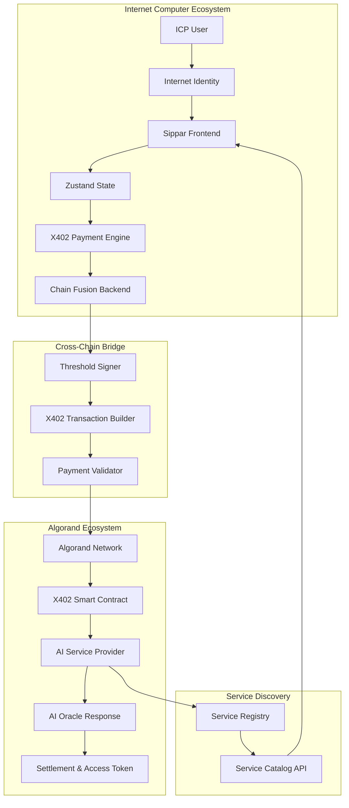

# Sprint 012 Technical Design
**X402 Protocol Integration Architecture**

**Date**: September 8, 2025  
**Sprint**: 012 - X402 Protocol Integration  
**Architecture**: Detailed technical design and implementation strategy  

---

## 🏗️ **System Architecture Overview**

### **High-Level Architecture**



### **Core Components**

1. **X402 Payment Engine**: Core payment processing logic
2. **Service Discovery System**: AI service catalog and registration
3. **Cross-Chain Bridge**: ICP ↔ Algorand payment routing
4. **Authentication Layer**: Service access and authorization
5. **Monitoring & Analytics**: Payment tracking and service usage

---

## 🔧 **Component Architecture**

### **1. X402 Payment Engine**

#### **Payment Service Class**
```typescript
interface X402PaymentService {
  // Payment lifecycle
  createPayment(request: PaymentRequest): Promise<PaymentResponse>;
  confirmPayment(paymentId: string): Promise<ConfirmationResponse>;
  validatePayment(paymentId: string): Promise<ValidationResponse>;
  refundPayment(paymentId: string, reason: string): Promise<RefundResponse>;
  
  // Service access
  grantServiceAccess(paymentId: string): Promise<AccessToken>;
  revokeServiceAccess(tokenId: string): Promise<void>;
  
  // Payment history
  getPaymentHistory(userId: string): Promise<PaymentRecord[]>;
  getServiceUsage(userId: string): Promise<UsageRecord[]>;
}

interface PaymentRequest {
  userId: string;
  serviceId: string;
  amount: number;
  currency: 'ALGO' | 'ckALGO';
  metadata: {
    aiModel: string;
    queryComplexity: 'low' | 'medium' | 'high';
    estimatedResponseTime: number;
    [key: string]: any;
  };
}

interface PaymentResponse {
  paymentId: string;
  status: 'created' | 'pending' | 'confirmed' | 'failed';
  amount: number;
  currency: string;
  estimatedConfirmationTime: number;
  transactionId?: string;
  errorMessage?: string;
}
```

#### **Payment State Management**
```typescript
enum PaymentStatus {
  CREATED = 'created',           // Payment request created
  VALIDATING = 'validating',     // Validating user credentials and balance
  PROCESSING = 'processing',     // Submitting to Algorand network
  CONFIRMED = 'confirmed',       // Transaction confirmed on-chain
  ACCESS_GRANTED = 'access_granted', // Service access token issued
  COMPLETED = 'completed',       // Service successfully consumed
  FAILED = 'failed',            // Payment failed at any stage
  REFUNDED = 'refunded'         // Payment refunded to user
}

interface PaymentState {
  paymentId: string;
  status: PaymentStatus;
  createdAt: number;
  updatedAt: number;
  expiresAt: number;
  attempts: number;
  lastError?: string;
  transactionHash?: string;
  accessToken?: string;
}
```

### **2. Service Discovery System**

#### **Service Registry Architecture**
```typescript
interface AIServiceRegistry {
  // Service management
  registerService(service: ServiceRegistration): Promise<string>;
  updateService(serviceId: string, updates: Partial<ServiceInfo>): Promise<void>;
  deactivateService(serviceId: string): Promise<void>;
  
  // Service discovery
  getAllServices(filters?: ServiceFilters): Promise<ServiceInfo[]>;
  getServiceById(serviceId: string): Promise<ServiceInfo>;
  searchServices(query: string): Promise<ServiceInfo[]>;
  
  // Health monitoring
  updateServiceHealth(serviceId: string, health: HealthStatus): Promise<void>;
  getServiceHealth(serviceId: string): Promise<HealthStatus>;
}

interface ServiceInfo {
  serviceId: string;
  name: string;
  description: string;
  provider: {
    name: string;
    algorandAddress: string;
    reputation: number;
    supportContact: string;
  };
  capabilities: {
    aiModels: string[];
    supportedLanguages: string[];
    responseTimeMs: number;
    maxQuerySize: number;
    specializations: string[];
  };
  pricing: {
    basePrice: number;
    currency: 'ALGO' | 'ckALGO';
    pricingModel: 'per_query' | 'per_token' | 'subscription';
    discounts?: PricingTier[];
  };
  x402Config: {
    paymentEndpoint: string;
    serviceEndpoint: string;
    authenticationMethod: 'token' | 'signature';
    accessDuration: number; // seconds
  };
  metadata: {
    category: string;
    tags: string[];
    createdAt: number;
    updatedAt: number;
    version: string;
  };
}
```

#### **Service Health Monitoring**
```typescript
interface HealthStatus {
  status: 'healthy' | 'degraded' | 'unhealthy' | 'offline';
  lastChecked: number;
  responseTime: number;
  uptime: number;
  errorRate: number;
  metrics: {
    totalRequests: number;
    successfulRequests: number;
    averageResponseTime: number;
    last24hUptime: number;
  };
  issues?: HealthIssue[];
}

interface HealthIssue {
  severity: 'low' | 'medium' | 'high' | 'critical';
  message: string;
  timestamp: number;
  resolved: boolean;
}
```

### **3. Cross-Chain Bridge Architecture**

#### **Chain Fusion X402 Bridge**
```typescript
interface ChainFusionX402Bridge {
  // Cross-chain payment routing
  routePayment(payment: CrossChainPayment): Promise<RoutingResult>;
  
  // State synchronization
  syncPaymentState(paymentId: string): Promise<void>;
  
  // Fee optimization
  calculateOptimalRoute(from: Chain, to: Chain, amount: number): Promise<Route>;
  
  // Settlement
  settlePayment(paymentId: string): Promise<SettlementResult>;
}

interface CrossChainPayment {
  paymentId: string;
  sourceChain: 'ICP' | 'Algorand';
  targetChain: 'ICP' | 'Algorand';
  sourceAddress: string;
  targetAddress: string;
  amount: number;
  currency: string;
  serviceId: string;
}

interface RoutingResult {
  route: PaymentRoute;
  estimatedTime: number;
  estimatedFees: FeeBreakdown;
  confirmationsRequired: number;
}

interface PaymentRoute {
  steps: RouteStep[];
  totalFees: number;
  totalTime: number;
}

interface RouteStep {
  action: 'convert' | 'transfer' | 'bridge' | 'settle';
  chain: string;
  estimatedTime: number;
  estimatedFee: number;
  details: any;
}
```

### **4. Authentication & Authorization**

#### **Service Access Control**
```typescript
interface X402AccessControl {
  // Token management
  generateAccessToken(paymentId: string, serviceId: string): Promise<AccessToken>;
  validateAccessToken(token: string): Promise<TokenValidation>;
  refreshAccessToken(token: string): Promise<AccessToken>;
  revokeAccessToken(token: string): Promise<void>;
  
  // Permission management
  checkServicePermissions(userId: string, serviceId: string): Promise<PermissionCheck>;
  grantServicePermissions(userId: string, serviceId: string, permissions: Permission[]): Promise<void>;
}

interface AccessToken {
  tokenId: string;
  token: string; // JWT or similar
  userId: string;
  serviceId: string;
  permissions: Permission[];
  issuedAt: number;
  expiresAt: number;
  metadata: {
    paymentId: string;
    serviceUsageLimit?: number;
    rateLimit?: RateLimit;
  };
}

interface Permission {
  resource: string; // e.g., 'ai_query', 'model_access'
  action: string;   // e.g., 'read', 'execute'
  conditions?: PermissionCondition[];
}

interface RateLimit {
  requests: number;
  windowSeconds: number;
  burst: number;
}
```

---

## 🔗 **Integration Architecture**

### **Frontend Integration**

#### **Zustand Store Extension**
```typescript
// Extend existing authStore with X402 state
interface X402State {
  // Payment state
  currentPayment: PaymentState | null;
  paymentHistory: PaymentRecord[];
  
  // Service state
  availableServices: ServiceInfo[];
  serviceFilters: ServiceFilters;
  selectedService: ServiceInfo | null;
  
  // Access tokens
  activeTokens: AccessToken[];
  
  // UI state
  showPaymentModal: boolean;
  showServiceBrowser: boolean;
  paymentLoading: boolean;
}

interface X402Actions {
  // Payment actions
  initiatePayment: (serviceId: string, amount: number) => Promise<void>;
  confirmPayment: (paymentId: string) => Promise<void>;
  cancelPayment: (paymentId: string) => Promise<void>;
  
  // Service actions
  loadServices: (filters?: ServiceFilters) => Promise<void>;
  selectService: (serviceId: string) => void;
  
  // Token actions
  refreshTokens: () => Promise<void>;
  revokeToken: (tokenId: string) => Promise<void>;
  
  // UI actions
  setShowPaymentModal: (show: boolean) => void;
  setShowServiceBrowser: (show: boolean) => void;
}

// Extended auth store with X402 capabilities
type ExtendedAuthStore = AuthStore & X402State & X402Actions;
```

#### **React Component Architecture**
```tsx
// X402 Payment Components
interface PaymentFlowProps {
  serviceId: string;
  amount: number;
  onSuccess: (paymentId: string) => void;
  onError: (error: string) => void;
}

const PaymentFlow: React.FC<PaymentFlowProps> = ({ serviceId, amount, onSuccess, onError }) => {
  const { initiatePayment, currentPayment } = useAuthStore();
  
  return (
    <PaymentModal>
      <ServiceInfo serviceId={serviceId} />
      <PricingDetails amount={amount} />
      <PaymentConfirmation onConfirm={() => initiatePayment(serviceId, amount)} />
      <PaymentStatus status={currentPayment?.status} />
    </PaymentModal>
  );
};

// Service Browser Component
const ServiceBrowser: React.FC = () => {
  const { availableServices, loadServices } = useAuthStore();
  
  return (
    <ServiceGrid>
      {availableServices.map(service => (
        <ServiceCard key={service.serviceId} service={service} />
      ))}
    </ServiceGrid>
  );
};
```

### **Backend Integration**

#### **API Route Structure**
```typescript
// X402 API Routes (extends existing /api/v1/ structure)
app.use('/api/v1/x402', x402Router);

const x402Router = express.Router();

// Payment endpoints
x402Router.post('/payments', createPayment);
x402Router.get('/payments/:paymentId', getPaymentStatus);
x402Router.post('/payments/:paymentId/confirm', confirmPayment);
x402Router.post('/payments/:paymentId/cancel', cancelPayment);

// Service endpoints  
x402Router.get('/services', getServiceCatalog);
x402Router.get('/services/:serviceId', getServiceDetails);
x402Router.post('/services/:serviceId/access', requestServiceAccess);

// Token endpoints
x402Router.get('/tokens', getUserTokens);
x402Router.post('/tokens/:tokenId/refresh', refreshToken);
x402Router.delete('/tokens/:tokenId', revokeToken);
```

#### **Middleware Integration**
```typescript
// Authentication middleware (extends existing)
const x402AuthMiddleware = (req: Request, res: Response, next: NextFunction) => {
  // Validate Internet Identity + X402 permissions
  const token = req.headers.authorization;
  const x402Token = req.headers['x-x402-token'];
  
  // Validate both tokens
  validateTokens(token, x402Token)
    .then(validation => {
      req.user = validation.user;
      req.x402Permissions = validation.permissions;
      next();
    })
    .catch(error => res.status(401).json({ error: 'Authentication failed' }));
};

// Rate limiting middleware for X402 endpoints
const x402RateLimiter = rateLimit({
  windowMs: 60 * 1000, // 1 minute
  max: 100, // 100 requests per minute per IP
  message: 'Too many X402 requests',
  standardHeaders: true,
  legacyHeaders: false,
});
```

---

## 🔒 **Security Architecture**

### **Payment Security**

#### **Transaction Signing Flow**
```typescript
interface SecurePaymentFlow {
  // Step 1: Payment validation
  validatePaymentRequest(request: PaymentRequest): Promise<ValidationResult>;
  
  // Step 2: Threshold signature preparation
  prepareThresholdSignature(transaction: AlgorandTransaction): Promise<SignatureRequest>;
  
  // Step 3: Multi-party computation
  executeThresholdSignature(signatureRequest: SignatureRequest): Promise<Signature>;
  
  // Step 4: Transaction submission
  submitSecureTransaction(signedTransaction: SignedTransaction): Promise<TransactionResult>;
}

// Threshold signature integration with existing Chain Fusion
interface ThresholdX402Integration {
  // Use existing threshold signer for X402 transactions
  signX402Payment(payment: X402Payment): Promise<SignedX402Payment>;
  
  // Validate signature integrity
  validateX402Signature(signedPayment: SignedX402Payment): Promise<boolean>;
  
  // Multi-signature coordination
  coordinateMultiSignature(paymentId: string): Promise<CoordinationResult>;
}
```

#### **Access Control Security**
```typescript
interface AccessSecurityLayer {
  // Token encryption
  encryptAccessToken(token: AccessToken, secret: string): Promise<string>;
  decryptAccessToken(encryptedToken: string, secret: string): Promise<AccessToken>;
  
  // Permission validation
  validatePermissions(token: AccessToken, requiredPermissions: Permission[]): boolean;
  
  // Audit trail
  logAccessAttempt(tokenId: string, serviceId: string, success: boolean): Promise<void>;
  
  // Fraud detection
  detectSuspiciousActivity(userId: string, activities: Activity[]): Promise<FraudAnalysis>;
}
```

### **Data Protection**

#### **Privacy & Encryption**
```typescript
interface DataProtection {
  // Sensitive data encryption
  encryptPaymentData(data: PaymentData): Promise<EncryptedData>;
  decryptPaymentData(encryptedData: EncryptedData): Promise<PaymentData>;
  
  // PII protection
  anonymizeUserData(userData: UserData): AnonymizedData;
  
  // Secure storage
  secureStore(key: string, data: any, ttl?: number): Promise<void>;
  secureRetrieve(key: string): Promise<any>;
  secureDelete(key: string): Promise<void>;
}

// Compliance with financial regulations
interface ComplianceLayer {
  // Transaction monitoring
  monitorTransaction(transaction: Transaction): Promise<ComplianceResult>;
  
  // KYC/AML integration
  performKYCCheck(userId: string): Promise<KYCResult>;
  
  // Regulatory reporting
  generateComplianceReport(period: DateRange): Promise<ComplianceReport>;
}
```

---

## 📊 **Data Architecture**

### **Database Schema Design**

#### **Payment Tables**
```sql
-- X402 Payments
CREATE TABLE x402_payments (
  payment_id VARCHAR(64) PRIMARY KEY,
  user_id VARCHAR(64) NOT NULL,
  service_id VARCHAR(64) NOT NULL,
  amount DECIMAL(18, 8) NOT NULL,
  currency VARCHAR(10) NOT NULL,
  status VARCHAR(20) NOT NULL,
  created_at TIMESTAMP DEFAULT CURRENT_TIMESTAMP,
  updated_at TIMESTAMP DEFAULT CURRENT_TIMESTAMP,
  expires_at TIMESTAMP,
  transaction_hash VARCHAR(64),
  error_message TEXT,
  metadata JSONB,
  
  INDEX idx_user_payments (user_id, created_at),
  INDEX idx_service_payments (service_id, created_at),
  INDEX idx_payment_status (status, created_at)
);

-- Service Registry
CREATE TABLE ai_services (
  service_id VARCHAR(64) PRIMARY KEY,
  name VARCHAR(255) NOT NULL,
  description TEXT,
  provider_address VARCHAR(58) NOT NULL,
  provider_info JSONB NOT NULL,
  capabilities JSONB NOT NULL,
  pricing JSONB NOT NULL,
  x402_config JSONB NOT NULL,
  status VARCHAR(20) DEFAULT 'active',
  created_at TIMESTAMP DEFAULT CURRENT_TIMESTAMP,
  updated_at TIMESTAMP DEFAULT CURRENT_TIMESTAMP,
  
  INDEX idx_service_status (status),
  INDEX idx_provider (provider_address)
);

-- Access Tokens
CREATE TABLE x402_access_tokens (
  token_id VARCHAR(64) PRIMARY KEY,
  payment_id VARCHAR(64) NOT NULL,
  user_id VARCHAR(64) NOT NULL,
  service_id VARCHAR(64) NOT NULL,
  token_hash VARCHAR(256) NOT NULL,
  permissions JSONB NOT NULL,
  issued_at TIMESTAMP DEFAULT CURRENT_TIMESTAMP,
  expires_at TIMESTAMP NOT NULL,
  revoked_at TIMESTAMP,
  usage_count INT DEFAULT 0,
  usage_limit INT,
  
  INDEX idx_user_tokens (user_id, expires_at),
  INDEX idx_payment_tokens (payment_id),
  FOREIGN KEY (payment_id) REFERENCES x402_payments(payment_id)
);
```

#### **Analytics and Monitoring**
```sql
-- Payment Analytics
CREATE TABLE payment_analytics (
  id BIGSERIAL PRIMARY KEY,
  payment_id VARCHAR(64) NOT NULL,
  event_type VARCHAR(50) NOT NULL,
  event_data JSONB,
  timestamp TIMESTAMP DEFAULT CURRENT_TIMESTAMP,
  
  INDEX idx_payment_analytics (payment_id, timestamp),
  INDEX idx_event_analytics (event_type, timestamp)
);

-- Service Usage Metrics
CREATE TABLE service_usage_metrics (
  id BIGSERIAL PRIMARY KEY,
  service_id VARCHAR(64) NOT NULL,
  date_hour TIMESTAMP NOT NULL,
  requests_count INT DEFAULT 0,
  success_count INT DEFAULT 0,
  error_count INT DEFAULT 0,
  total_amount DECIMAL(18, 8) DEFAULT 0,
  avg_response_time DECIMAL(8, 2) DEFAULT 0,
  
  UNIQUE(service_id, date_hour),
  INDEX idx_service_metrics (service_id, date_hour)
);
```

### **Caching Strategy**

#### **Redis Cache Architecture**
```typescript
interface X402CacheStrategy {
  // Service catalog caching
  cacheServiceCatalog(services: ServiceInfo[], ttl: number): Promise<void>;
  getCachedServices(filters?: ServiceFilters): Promise<ServiceInfo[] | null>;
  
  // Payment state caching
  cachePaymentState(paymentId: string, state: PaymentState): Promise<void>;
  getCachedPaymentState(paymentId: string): Promise<PaymentState | null>;
  
  // Access token caching
  cacheAccessToken(tokenId: string, token: AccessToken): Promise<void>;
  getCachedToken(tokenId: string): Promise<AccessToken | null>;
  
  // Service health caching
  cacheServiceHealth(serviceId: string, health: HealthStatus): Promise<void>;
  getCachedHealth(serviceId: string): Promise<HealthStatus | null>;
}

// Cache configuration
const cacheConfig = {
  serviceCatalog: { ttl: 300 },     // 5 minutes
  paymentState: { ttl: 3600 },      // 1 hour
  accessTokens: { ttl: 1800 },      // 30 minutes
  serviceHealth: { ttl: 60 },       // 1 minute
};
```

---

## 📈 **Performance Architecture**

### **Optimization Strategies**

#### **Payment Processing Optimization**
```typescript
interface PerformanceOptimization {
  // Batch payment processing
  batchPayments(payments: PaymentRequest[]): Promise<BatchResult>;
  
  // Connection pooling
  getOptimizedConnection(target: 'algorand' | 'icp'): Promise<Connection>;
  
  // Caching layers
  cacheFrequentOperations(operation: string, result: any, ttl: number): Promise<void>;
  
  // Load balancing
  routeToOptimalNode(request: ServiceRequest): Promise<NodeSelection>;
}

// Performance monitoring
interface PerformanceMonitoring {
  // Latency tracking
  trackPaymentLatency(paymentId: string, stage: string, duration: number): Promise<void>;
  
  // Throughput monitoring
  trackThroughput(endpoint: string, requestCount: number, timeWindow: number): Promise<void>;
  
  // Resource utilization
  monitorResources(): Promise<ResourceMetrics>;
  
  // Performance alerts
  checkPerformanceThresholds(): Promise<PerformanceAlert[]>;
}
```

---

## 🎯 **Implementation Phases**

### **Phase 1: Core Infrastructure (Days 1-2)**
1. X402 payment engine foundation
2. Database schema implementation
3. Basic API endpoints
4. Threshold signature integration

### **Phase 2: Service Integration (Days 3-4)**
1. Service registry implementation
2. Service discovery API
3. Health monitoring system
4. AI Oracle X402 integration

### **Phase 3: Frontend & UX (Days 5-6)**
1. Payment UI components
2. Service browser interface
3. Zustand store extension
4. Mobile-responsive design

### **Phase 4: Testing & Deployment (Day 7)**
1. Comprehensive testing suite
2. Performance optimization
3. Security audit
4. Production deployment

---

**Architecture Status**: ✅ **COMPLETE**  
**Next Phase**: Implementation Timeline and Resource Planning  
**Complexity Assessment**: High (new protocol) with solid foundation (existing Chain Fusion)  
**Risk Mitigation**: Incremental development with extensive testing at each phase