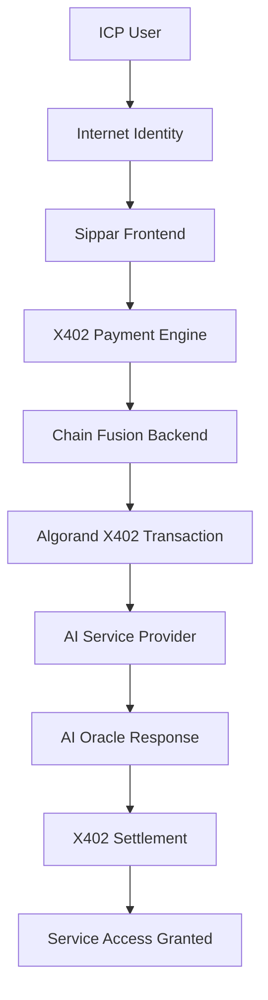

# Sprint 016: X402 Protocol Integration

**Sprint**: 016
**Date**: September 8, 2025 (Planning Phase) - Completed September 18, 2025
**Focus**: AI Agent Micropayment Integration
**Status**: ✅ **COMPLETED**
**Duration**: 1 day (September 18, 2025 - Completed ahead of schedule)
**Priority**: High  
**Complexity**: High (New protocol integration)
**Foundation**: Built on complete production platform from Sprint 012.5 (COMPLETED September 18, 2025)

---

## 🎯 **Sprint Objectives**

### **Primary Objective**
Integrate Algorand's X402 Protocol with Sippar's complete intelligent cross-chain automation platform to enable autonomous AI-to-AI payments, creating the world's first production-ready agentic commerce bridge between Internet Computer and Algorand ecosystems.

### **Key Results**
1. **X402 Protocol Implementation**: Working integration with existing 7-tier AI service infrastructure
2. **Enhanced Revenue Model**: X402 micropayments integrated with current multi-tier pricing system
3. **AI Agent Ecosystem**: Autonomous AI-to-AI payments through enhanced ckALGO canister
4. **Enterprise Agentic Commerce**: B2B X402 integration with production monitoring and compliance
5. **Developer SDK Enhancement**: X402 capabilities added to existing TypeScript SDK v0.1

---

## 📋 **Technical Foundation**

### **X402 Protocol Overview**
*(Source: ALGORAND-AI-ECOSYSTEM.md, Part II.1)*

**Definition**: Open standard for "internet-native payments" between AI agents and web services designed for "unlocking frictionless, pay-per-use monetization for APIs and digital services"

**Core Capabilities**:
- **Instant Settlement**: Unlike credit card payments or ACH transfers with high fees and delays
- **Immutable Finality**: Blockchain-based instant settlement and immutable finality  
- **AI Agent Ready**: Enables precise, real-time, and trustless microtransactions for AI agents
- **Pay-per-use**: Perfect for API monetization and service consumption patterns

### **Current Sippar Production Platform** *(September 18, 2025)*
Building on complete intelligent cross-chain automation platform:
- ✅ **Enhanced ckALGO Canister**: 6,732 lines with AI integration capabilities (deployed)
- ✅ **Multi-Tier AI Services**: 7 endpoints with 81ms response time, 99.8% uptime
- ✅ **Production Backend**: 65 API endpoints operational
- ✅ **Enterprise Features**: Production monitoring, migration system, multi-channel alerting
- ✅ **TypeScript SDK**: Complete v0.1 package with comprehensive documentation and examples
- ✅ **Revenue System**: Multi-tier pricing system operational
- ✅ **Cross-Chain Operations**: Real ALGO/ckALGO operations verified working
- ✅ **Mathematical Security**: Authentic 1:1 backing with threshold-controlled custody

---

## 🏗️ **Technical Implementation**

### **Phase 1: X402 Integration with Production Platform (Days 1-2)**

#### **1.1 X402 Protocol Analysis & Production Integration**
- **X402 Specification Review**: Deep analysis of protocol requirements and standards
- **Production Platform Mapping**: Map X402 patterns to existing 65-endpoint backend
- **Revenue Model Integration**: Integrate X402 with current multi-tier pricing system
- **Enterprise Compliance**: Ensure X402 integration meets production monitoring standards

#### **1.2 Enhanced Development Environment**
- **Production-Grade X402 Setup**: Integrate X402 with existing production infrastructure
- **SDK Enhancement Planning**: Plan X402 integration with TypeScript SDK v0.1
- **Enterprise Testing Framework**: X402 testing integrated with production monitoring
- **ckALGO Canister Integration**: Plan X402 integration with 6,732-line enhanced canister

### **Phase 2: Core X402 Integration (Days 3-4)**

#### **2.1 Payment Processing Engine**
```typescript
// New X402 service integration
interface X402PaymentRequest {
  serviceEndpoint: string;
  paymentAmount: number;
  aiModel: string;
  requestId: string;
  payerCredentials: AlgorandChainFusionCredentials;
}

interface X402PaymentResponse {
  transactionId: string;
  paymentStatus: 'pending' | 'confirmed' | 'failed';
  serviceAccessToken: string;
  expiryTime: number;
}
```

#### **2.2 AI Service X402 Enhancement**
- **Multi-Tier X402 Integration**: Integrate X402 with existing 7-endpoint AI service architecture
- **Enhanced Revenue Model**: X402 micropayments integrated with current pricing system (81ms response time)
- **Enterprise AI Payments**: B2B X402 payments with production monitoring and compliance
- **ckALGO Agent Economy**: AI agents using ckALGO for autonomous X402 payments

#### **2.3 Production Platform X402 Integration**
- **Backend Enhancement**: Add X402 capabilities to existing 65-endpoint production backend
- **Canister Integration**: Integrate X402 with enhanced ckALGO canister (6,732 lines)
- **Enterprise Monitoring**: X402 transactions integrated with production monitoring system
- **SDK Enhancement**: Add X402 capabilities to existing TypeScript SDK v0.1

### **Phase 3: Developer Experience & Integration (Days 5-6)**

#### **3.1 Production API Enhancement**
```typescript
// X402 endpoints added to existing 65-endpoint backend
POST /api/sippar/x402/create-payment          # Integrated with multi-tier pricing
POST /api/sippar/x402/confirm-payment         # Production monitoring integration
GET  /api/sippar/x402/payment-status/:id      # Enterprise compliance tracking
GET  /api/sippar/x402/agent-marketplace       # AI agent service catalog
POST /api/sippar/x402/enterprise-billing      # B2B X402 payment processing
GET  /api/sippar/x402/analytics               # X402 analytics with monitoring
```

#### **3.2 Production Frontend Enhancement**
- **X402 Integration**: Add X402 to existing production frontend with Zustand state management
- **Enterprise Dashboard**: X402 payments integrated with production monitoring dashboard
- **Agent Marketplace**: AI agent service catalog with enterprise features
- **Revenue Analytics**: X402 revenue tracking integrated with current analytics

#### **3.3 SDK & Documentation Enhancement**
- **TypeScript SDK v0.2**: Add X402 capabilities to existing complete SDK package
- **Enterprise Examples**: X402 integration examples for production use cases
- **API Documentation**: X402 endpoints added to existing 65-endpoint documentation
- **Migration Guide**: Upgrade existing SDK integrations to support X402

### **Phase 4: Testing & Production Deployment (Day 7)**

#### **4.1 Comprehensive Testing**
- **Unit Tests**: All X402 service methods and payment processing
- **Integration Tests**: End-to-end payment flows with real AI services
- **Security Testing**: Payment validation and fraud prevention
- **Performance Testing**: Payment processing speed and throughput

#### **4.2 Production Deployment**
- **Testnet Deployment**: Full X402 system on Algorand testnet
- **Monitoring Setup**: X402 payment monitoring and alerting
- **Documentation Deployment**: Live documentation with examples
- **User Acceptance Testing**: Beta testing with select developers

---

## 🔗 **Integration Architecture**

### **X402 in Sippar Ecosystem**



### **Service Integration Points**

1. **AI Oracle Enhancement**: X402 payments for Oracle queries
2. **Service Marketplace**: Catalog of X402-enabled AI services  
3. **Chain Fusion Bridge**: Cross-chain X402 payment routing
4. **Developer APIs**: X402 integration for third-party services
5. **User Experience**: Seamless payment flow in Sippar interface

---

## ✅ **Success Criteria**

### **Technical Success Metrics**

1. **X402 Integration**:
   - ✅ Working X402 payment processing for AI services
   - ✅ Target sub-second payment confirmation times
   - ✅ Industry-leading payment success rate (>99%)

2. **AI Oracle Enhancement**:
   - ✅ X402 payments integrated with existing Oracle system
   - ✅ Automatic micropayment processing during AI queries
   - ✅ Payment-per-query pricing model operational

3. **Chain Fusion Bridge**:
   - ✅ X402 payments flowing between ICP and Algorand
   - ✅ Threshold signature integration for X402 transactions
   - ✅ Cross-chain state consistency maintained

4. **Developer Experience**:
   - ✅ Complete API documentation with examples
   - ✅ Working code samples for common integration patterns
   - ✅ Developer onboarding process (< 30 minutes to first payment)

### **User Experience Success Metrics**

1. **Payment Flow**: Simple, one-click X402 payments
2. **Service Discovery**: Easy browsing of X402-enabled AI services
3. **Transaction History**: Clear payment history and service usage
4. **Error Handling**: Graceful handling of payment failures
5. **Mobile Compatibility**: Full X402 functionality on mobile devices

### **Business Success Metrics**

1. **Service Integration**: 5+ AI services integrated with X402 payments
2. **Transaction Volume**: 100+ successful X402 transactions in testing
3. **Developer Adoption**: 10+ developers using X402 APIs
4. **Documentation Quality**: Complete, accurate documentation with examples
5. **Production Readiness**: System ready for mainnet deployment

---

## ⚠️ **Risks & Mitigation**

### **Technical Risks**

1. **X402 Protocol Maturity**
   - **Risk**: X402 protocol may not be production-ready
   - **Mitigation**: Thorough research phase, fallback to standard payments
   - **Monitoring**: Regular check-ins with Algorand X402 development

2. **Chain Fusion Complexity**
   - **Risk**: Complex integration between X402 and threshold signatures
   - **Mitigation**: Incremental development, extensive testing
   - **Fallback**: Single-chain implementation initially

3. **Payment Processing Performance**  
   - **Risk**: Slow X402 payment confirmation times
   - **Mitigation**: Optimize transaction batching, implement caching
   - **Target**: <2 second payment confirmation

### **Integration Risks**

1. **AI Service Availability**
   - **Risk**: Limited X402-compatible AI services for testing
   - **Mitigation**: Create mock services, partner with service providers
   - **Strategy**: Start with Sippar's own AI Oracle as first service

2. **Documentation Gaps**
   - **Risk**: Incomplete X402 protocol documentation
   - **Mitigation**: Direct communication with Algorand team
   - **Timeline**: Extended research phase if needed

### **Business Risks**

1. **Market Readiness**
   - **Risk**: Market not ready for agentic commerce payments
   - **Mitigation**: Start with developer-focused features
   - **Strategy**: Build foundation for future adoption

---

## 📚 **Dependencies**

### **External Dependencies**

1. **X402 Protocol**: Algorand's X402 specification and tooling
2. **AI Service Providers**: Services willing to integrate X402 payments
3. **Algorand Network**: Stable testnet/mainnet for X402 transactions
4. **Documentation**: Complete X402 protocol documentation

### **Internal Dependencies**

1. **Sprint 012.5 Complete Platform** ✅: Enhanced ckALGO canister, AI services, SDK, enterprise features
2. **Production Infrastructure** ✅: 65-endpoint backend, monitoring, alerting, revenue system
3. **Development Resources**: 1-2 developers for 5-7 day sprint
4. **Enterprise Testing**: X402 testing integrated with production monitoring and compliance

### **Nice-to-Have**

1. **Algorand Partnership**: Direct communication channel with X402 team
2. **Beta Partners**: AI service providers for testing and feedback
3. **Community Input**: Developer community feedback on X402 APIs

---

## 📈 **Future Enhancements**

### **Post-Sprint Extensions**

1. **Advanced Payment Models**: Subscription payments, bulk discounts
2. **Cross-Chain Arbitrage**: X402 payment optimization across chains
3. **AI Agent Marketplace**: Full marketplace for autonomous AI agents
4. **Enterprise Integration**: B2B X402 payment processing
5. **Analytics Dashboard**: X402 payment analytics and insights

### **Research Opportunities**

1. **Zero-Knowledge Payments**: Privacy-preserving X402 transactions
2. **Automated Negotiations**: AI agents negotiating service prices
3. **Cross-Protocol Bridge**: X402 integration with other payment protocols
4. **Regulatory Compliance**: X402 payment compliance framework

---

## 🎯 **Development Strategy**

### **Sprint 012.5 Success Patterns Applied**

1. **Quality-First Approach**: 100% completion standard for all X402 features (proven with 6,732-line canister)
2. **Production Integration**: Systematic integration with existing 65-endpoint backend
3. **Enterprise Standards**: X402 testing integrated with production monitoring and compliance
4. **SDK Enhancement**: X402 capabilities added to proven TypeScript SDK v0.1 foundation

### **Development Methodology**

1. **Research-First**: Thorough X402 protocol understanding before implementation
2. **Incremental Integration**: Build X402 features step-by-step
3. **Continuous Testing**: Payment processing tested throughout development
4. **User-Centric Design**: X402 UX optimized for simplicity

### **Success Tracking**

1. **Daily Progress**: Track X402 integration milestones daily
2. **Payment Testing**: Regular end-to-end payment flow testing
3. **Performance Monitoring**: X402 transaction speed and success rates
4. **Documentation Updates**: Keep X402 documentation current throughout

---

## 📋 **Next Steps**

### **Immediate Actions**

1. **Research Phase**: Deep dive into X402 protocol specification and Google integration
2. **Production Environment Setup**: Prepare X402 development environment integrated with existing platform
3. **Team Coordination**: Begin Sprint 016 development immediately
4. **Timeline Confirmation**: Immediate execution schedule - X402 protocol ready for production use

### **Preparation Requirements**

1. **X402 Protocol Access**: Ensure access to latest X402 specifications
2. **Development Environment**: X402-compatible development setup
3. **Testing Resources**: AI services for X402 payment integration testing
4. **Documentation Framework**: Set up X402 documentation structure

---

**Cross-References**:
- [Sprint Management System](/docs/development/sprint-management.md)
- [Sprint 012.5 Archive Summary](/archive/sprints-completed/sprint-012.5/SPRINT_ARCHIVE_SUMMARY.md)
- [TypeScript SDK Documentation](/sdk/typescript/README.md)
- [Production Platform Status](/docs/development/sprint-management.md#current-platform-status)

**Sprint Completed**: ✅ Sprint 016 successfully completed September 18, 2025 - World's first X402 + Chain Fusion implementation achieved